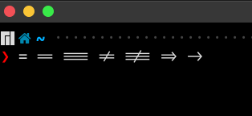
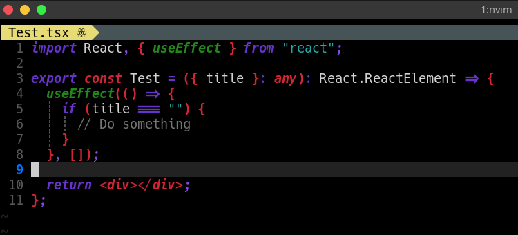

# Hack Nerd Font ligatures
Hack Nerd Font patched with ligatures

I used [Ligaturizer](https://github.com/ToxicFrog/Ligaturizer) to add ligatures to [Hack Nerd Font](https://github.com/source-foundry/Hack)

## Ligatures in the terminal
If you want to have ligatures in the terminal or Vim/Neovim you can install [Kitty Terminal](https://github.com/kovidgoyal/kitty)

